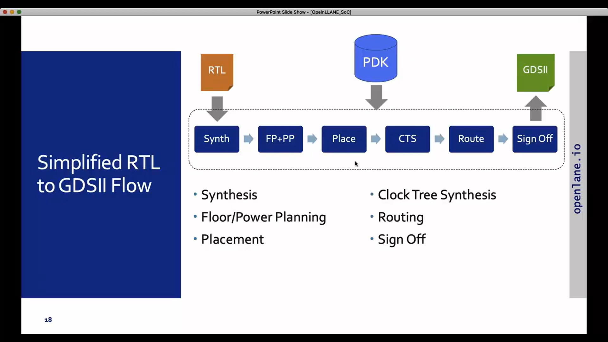
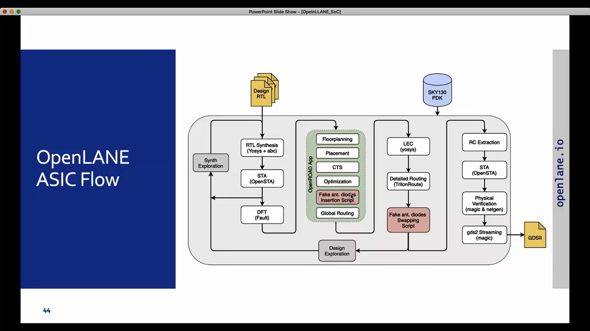
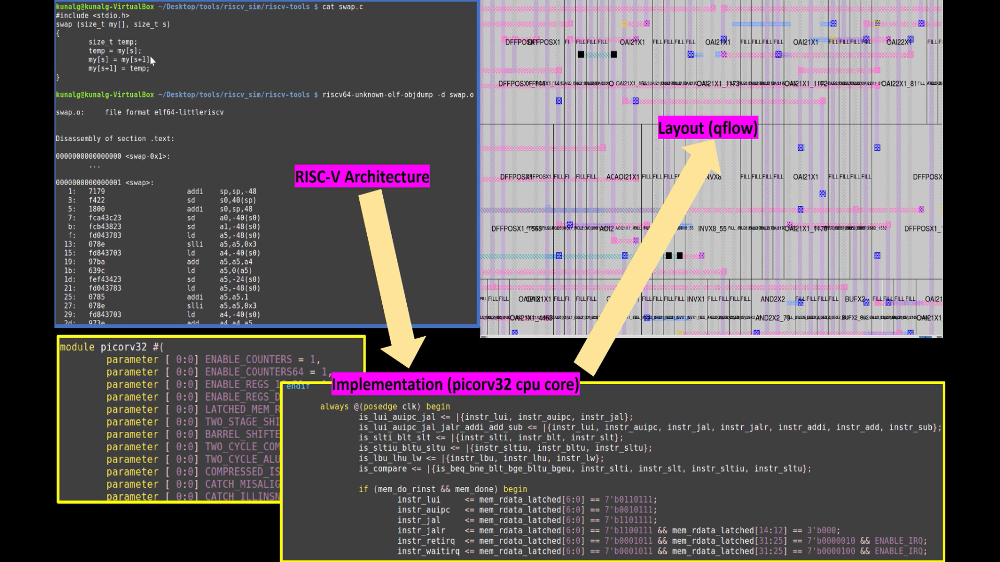
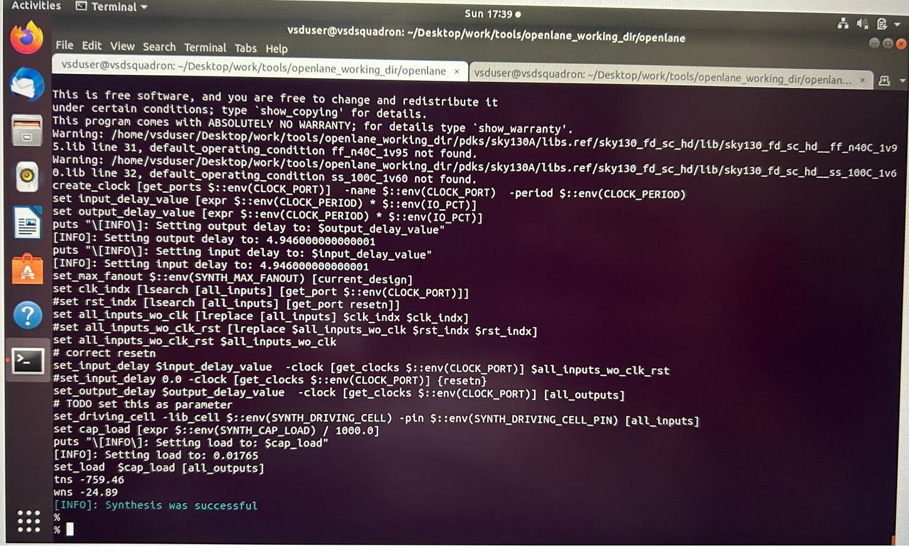

# OpenLane SKY130 Workshop – Day 1
## Inception of Open-Source EDA, OpenLANE and SKY130 PDK

### Author
**Varun Venkata**

### Workshop
VSD OpenLANE SKY130 Workshop

### Day Objectives

- Understand the ASIC Design Flow
- Learn OpenLANE Architecture
- Understand SKY130 PDK
- Study RISC-V and Open-Source Hardware
- Run Synthesis using OpenLANE
- Analyze Synthesis Results
---
## Table of Contents

1. Introduction
2. Software to Hardware Flow
3. Chip Components and SoC Architecture
4. RISC-V ISA
5. Open-Source ASIC Design
6. RTL to GDSII Flow
7. OpenLANE Flow
8. SKY130 PDK
9. Practical Lab
10. Synthesis Results
11. Key Learnings

---
# 1️. Understanding Computer Abstraction Layers

## Why Do We Need Abstraction?

Humans communicate using programming languages, while computers understand only binary values (0 and 1). To bridge this gap, multiple abstraction layers are used, where each layer translates information into a form understandable by the next layer.

## Abstraction Flow

```text
High-Level Language (C, Python, Java)
            ↓
Compiler
            ↓
Assembly Language
            ↓
Assembler
            ↓
Machine Code
            ↓
Processor Hardware
            ↓
Transistor Switching
```

## Role of Each Layer
* **High-Level Language:** Allows programmers to write applications without worrying about hardware details.
* **Compiler:** Converts source code into assembly instructions.
* **Assembly Language:** Human-readable representation of machine instructions.
* **Machine Code:** Binary instructions executed directly by the processor.
* **ISA (Instruction Set Architecture):** Acts as a bridge between software and hardware by defining instructions, registers, and memory operations.
## Key Learning
The ISA is the fundamental interface between software and hardware. As VLSI engineers, our responsibility is to design hardware that correctly implements the ISA specifications.

<p align="center">
  
</p>
<p align="center"><b>Figure 1:</b> Software to Hardware Flow</p>

## 2️. Chip Anatomy – Understanding the Building Blocks of a Chip

Before learning the OpenLANE flow, it is important to understand what actually exists inside a semiconductor chip.

A chip is not just a small black component that we see on a PCB. Internally, it consists of a silicon die enclosed inside a package. The package protects the die and provides electrical connections to the external world.

### Chip Structure

**Chip = Die + Package**

### Package

The package acts as the outer covering of the chip. It performs multiple functions:

* Protects the silicon die from physical damage.
* Provides connections between the chip and the PCB.
* Helps in dissipating the heat generated during operation.

One commonly used package type is **QFN (Quad Flat No-Lead)**, which offers compact size and good thermal performance.

### Die

The die is the actual silicon portion where all electronic circuits are fabricated.

Inside the die we can find:

* Core Region
* I/O Cells
* Memory Blocks
* Analog and Digital IPs

The die is manufactured on a silicon wafer and later separated into individual chips through a process called dicing.

### Core

The core is the working area of the chip where most computations take place.

It generally contains:

* Standard Cells
* Sequential Elements (Flip-Flops)
* SRAM Blocks
* Processor Logic
* Custom Macros

This is the region where the actual functionality of the design is implemented.

### Pads

Pads form the interface between the internal circuitry and the outside world.

Common pad types include:

* Power Pads (VDD, VSS)
* Input Pads
* Output Pads
* Bidirectional Pads
* Analog Pads

These pads are arranged around the chip boundary and connect to the package pins.

### Macros and IP Blocks

Modern chips are built using reusable blocks instead of designing everything from scratch.

Some examples include:

* SRAM
* UART
* SPI
* ADC
* PLL
* Processor Cores

These reusable blocks are known as Intellectual Property (IP) blocks.

IPs are generally categorized as:

| IP Type | Description                                                         |
| ------- | ------------------------------------------------------------------- |
| Soft IP | Provided as RTL and can be synthesized for different technologies   |
| Hard IP | Delivered as a fixed layout and optimized for a specific technology |
| Firm IP | Intermediate form with some flexibility in implementation           |

### My Understanding

From this section, I learned that a complete chip is a combination of several smaller functional blocks working together. The processor is only one part of the system; memories, I/O interfaces, analog circuits, and foundry-provided IPs are equally important in building a complete SoC.

<p align="center">
  
</p>

<p align="center"><b>Figure 2:</b> SoC Architecture Showing Macros and Foundry IPs</p>

## 3. RISC-V and the ISA Bridge
### What is RISC-V?

RISC-V is an open-source Instruction Set Architecture (ISA) developed at UC Berkeley. Unlike proprietary architectures, it can be used and modified freely, making it popular in academia, research, and industry.

### Why RISC-V?

Some reasons for its growing adoption are:

* Open-source and royalty-free
* Modular architecture with optional extensions
* Easy to learn and implement
* Widely used in embedded and SoC designs

### Understanding the ISA

The ISA acts as a bridge between software and hardware. It defines how software communicates with the processor through instructions.

For example:

```assembly
add x5, x6, x7
```

This instruction tells the processor to add the values stored in registers `x6` and `x7` and store the result in `x5`.

### Key Learning

I understood that the ISA provides a common interface between hardware designers and software developers. As long as the processor follows the RISC-V specification, it can execute RISC-V programs correctly.
## 4. From Software to Silicon

One of the most interesting concepts covered in Day 1 was understanding how a software application finally becomes hardware running on silicon.

### Design Flow

```text
Application
    ↓
Compiler
    ↓
Assembly Code
    ↓
Machine Code
    ↓
Processor
    ↓
RTL Design
    ↓
Synthesis
    ↓
Physical Design
    ↓
Fabricated Chip
```

Each stage transforms the design into a lower-level representation until it becomes an actual silicon implementation.

### Key Learning

A mistake at any stage of this flow can affect the final chip. Understanding the complete path helps in debugging and developing reliable hardware systems.

## 5. Open-Source ASIC Design Ecosystem

Traditional ASIC development relied heavily on expensive commercial tools and proprietary process technologies. The open-source hardware movement has changed this by providing accessible design resources.

### Three Important Pillars

#### 1. Open RTL Designs

Design sources are available from platforms such as:

* OpenCores
* LibreCores
* GitHub repositories

#### 2. Open-Source EDA Tools

Some commonly used tools are:

| Tool     | Purpose              |
| -------- | -------------------- |
| Yosys    | RTL Synthesis        |
| ABC      | Logic Optimization   |
| OpenROAD | Physical Design      |
| OpenSTA  | Timing Analysis      |
| Magic    | Layout and DRC       |
| Netgen   | LVS Verification     |
| KLayout  | Layout Visualization |

#### 3. Open PDK

The SKY130 PDK made it possible for students and researchers to design manufacturable chips using an openly available process technology.

### Key Learning

The combination of open RTL, open EDA tools, and an open PDK has made ASIC design more accessible to the engineering community.
## 6. RTL-to-GDSII Design Flow

One of the key topics covered in Day 1 was understanding how a hardware description written in RTL is converted into a manufacturable chip layout. This complete process is known as the **RTL-to-GDSII Flow**.

<p align="center">
  
</p>

<p align="center"><b>Figure 3:</b> RTL to GDSII Flow IPs</p>

### 1. Synthesis

The design flow starts with RTL written in Verilog. During synthesis, the RTL code is converted into a gate-level netlist using standard cells available in the technology library.

**Output:** Gate-level Netlist

### 2. Floorplanning

In this stage, the overall chip area is defined. Locations for I/O pins, standard cell rows, and large macros such as SRAM are decided.

**Goal:** Create an efficient layout structure for the design.

### 3. Power Planning

A Power Distribution Network (PDN) is created to ensure reliable delivery of VDD and GND throughout the chip.

Major components include:

* Power Rings
* Power Straps
* Standard Cell Power Rails

### 4. Placement

Standard cells from the synthesized netlist are placed inside the floorplanned area.

Placement is generally performed in two steps:

* Global Placement
* Detailed Placement

Proper placement helps reduce routing congestion and improves timing performance.

### 5. Clock Tree Synthesis (CTS)

CTS builds a balanced clock network that distributes the clock signal to all sequential elements in the design.

**Objective:** Minimize clock skew and ensure synchronized operation of flip-flops.

### 6. Routing

Routing creates physical connections between all placed cells using available metal layers.

Routing is performed in two stages:

* Global Routing
* Detailed Routing

At the end of this stage, all nets are physically connected.

### 7. Sign-Off and Verification

Before fabrication, the design undergoes several verification checks:

* **DRC (Design Rule Check)** – verifies manufacturing rules.
* **LVS (Layout Versus Schematic)** – checks whether layout matches the intended design.
* **STA (Static Timing Analysis)** – verifies timing requirements.

### Final Output

After successful verification, the final layout is generated as a **GDSII file**, which is sent to the fabrication facility for chip manufacturing.

### Key Learning

I learned that chip design is not limited to writing Verilog code. Several physical design stages such as floorplanning, placement, CTS, routing, and verification are required before a design can be fabricated into silicon.

## 7. Understanding OpenLANE

### What is OpenLANE?

OpenLANE is an open-source digital ASIC implementation flow developed by eFabless. Instead of being a single software tool, it combines multiple open-source EDA tools into a complete RTL-to-GDSII design flow.

The main purpose of OpenLANE is to automate the chip design process and reduce manual intervention during physical design.

### OpenLANE Flow
<p align="center">
  
</p>
<p align="center"><b>Figure 4:</b> OpenLANE Flow IPs</p>

The flow starts with RTL and gradually converts the design into a manufacturable GDSII layout.

### Main Objective

The primary goal of OpenLANE is to generate a **clean GDSII** by automatically performing all major implementation stages.

A successful design should satisfy:

* No DRC violations
* No LVS mismatches
* Acceptable timing performance

### Major Design Stages

```text
RTL Design
    ↓
Synthesis
    ↓
Floorplanning
    ↓
Placement
    ↓
Clock Tree Synthesis
    ↓
Routing
    ↓
Physical Verification
    ↓
GDSII Generation
```

Each stage prepares the design for the next step until the final layout is produced.

### Operating Modes

OpenLANE can be used in two different ways:

| Mode             | Description                                |
| ---------------- | ------------------------------------------ |
| Interactive Mode | Execute and analyze each step individually |
| Automated Mode   | Run the complete flow automatically        |

Interactive mode is particularly useful for learning and debugging, while automated mode is preferred for full-chip execution.

### Antenna Violation Handling

During fabrication, long metal wires may accumulate electrical charge and damage transistor gates. This issue is known as an antenna violation.

OpenLANE automatically detects such violations and inserts antenna protection diodes wherever required, helping improve manufacturing reliability.

### Why OpenLANE is Important

Before the availability of OpenLANE and SKY130, ASIC design was mainly restricted to companies with access to expensive commercial tools.

OpenLANE has made it possible for students, researchers, and hardware enthusiasts to learn and perform complete ASIC implementation using open-source resources.

### Key Learning

From this section, I learned how OpenLANE integrates several EDA tools into a unified flow and automates the major stages of ASIC physical design. It provides a practical platform for transforming RTL designs into fabrication-ready layouts using open-source technology.

## 8. SKY130 PDK – Foundation of Open-Source Chip Design

### What is a PDK?

A **Process Design Kit (PDK)** is a collection of files and design information provided by a semiconductor foundry. It acts as a bridge between circuit design and chip manufacturing.

Without a PDK, designers would not know the fabrication rules, available layers, transistor behavior, or standard cells required to create a working chip.

### Key Components of a PDK

| Component        | Purpose                                                    |
| ---------------- | ---------------------------------------------------------- |
| Design Rules     | Define manufacturing constraints such as spacing and width |
| SPICE Models     | Used to simulate transistor behavior                       |
| Standard Cells   | Pre-designed logic gates and sequential elements           |
| Technology Files | Describe layers, parasitics, and process information       |
| I/O Cells        | Interface the chip with the external world                 |

### Introduction to SKY130

SKY130 is a 130nm CMOS technology node released through a collaboration between SkyWater Technology and Google. It became one of the first production-grade open-source PDKs available to the VLSI community.

The availability of SKY130 has made practical ASIC design accessible to students, researchers, and open-source hardware developers.

### Why SKY130 is Popular

Some reasons why SKY130 is widely used in learning and research are:

* Completely open-source and freely accessible
* Stable and well-documented technology node
* Supported by OpenLANE and OpenROAD flows
* Suitable for digital, analog, and mixed-signal designs
* Enables real silicon fabrication through open MPW programs

### Standard Cell Libraries

SKY130 provides multiple standard cell libraries optimized for different design requirements.

| Library           | Optimization Target |
| ----------------- | ------------------- |
| sky130_fd_sc_hd   | High Density        |
| sky130_fd_sc_hdll | Low Leakage         |
| sky130_fd_sc_hs   | High Speed          |
| sky130_fd_sc_ls   | Low Speed           |
| sky130_fd_sc_ms   | Medium Speed        |

For most OpenLANE experiments, the **High Density (HD)** library is commonly used.

### Understanding Cell Names

Example:

```text
sky130_fd_sc_hd__nand2_1
```

Breakdown:

* **sky130** → SkyWater 130nm technology
* **fd_sc** → Foundry standard cell library
* **hd** → High Density library
* **nand2** → 2-input NAND gate
* **1** → Drive strength

Different drive strengths are available depending on the required performance and load conditions.

### What I Learned

One important takeaway from this section is that the PDK is the backbone of the ASIC design flow. While EDA tools automate the design process, the PDK provides the manufacturing knowledge required to transform a design into a real silicon chip.

The release of SKY130 has significantly contributed to the growth of open-source VLSI design by making professional chip design resources available to everyone.

## 9. Hands-on Lab: OpenLANE Setup and Synthesis Flow

After understanding the theoretical concepts, the next step was to explore the OpenLANE environment and execute the initial stages of the ASIC design flow using the PicoRV32A design.

### Working Environment

The complete flow was executed inside an OpenLANE Docker environment. Using Docker ensures that all required tools, libraries, and dependencies are available in a consistent setup, avoiding configuration issues across different systems.

### Launching the OpenLANE Environment

First, I entered the OpenLANE directory and mounted the Docker container:

```bash
cd ~/Desktop/OpenLane
make mount
```

This command starts the OpenLANE environment and loads the required PDK and standard cell libraries needed for the design flow.

### Starting Interactive Mode

To execute individual stages manually and understand the flow better, I launched OpenLANE in interactive mode:

```bash
./flow.tcl -interactive
```

Interactive mode provides more control over each stage and helps in analyzing intermediate outputs.

### Loading the OpenLANE Package

Inside the OpenLANE shell, the package was loaded using:

```tcl
package require openlane
```

Successful loading confirmed that the OpenLANE environment was ready for execution.

### Preparing the Design

The PicoRV32A design was prepared using:

```tcl
prep -design picorv32a
```

During this stage, OpenLANE:

* Reads the design configuration files
* Loads SKY130 technology information
* Generates the required working directories
* Creates merged LEF files
* Initializes logs, reports, and result folders

This step acts as the foundation for all subsequent design stages.
<p align="center">
  
</p>

<p align="center"><b>Figure 5:</b> Picorv32_Flow IPs</p>

### Running Synthesis

After preparation, synthesis was executed using:

```tcl
run_synthesis
```
<p align="center">
  
</p>

<p align="center"><b>Figure 6:</b> prep_design_synthesis IPs</p>

During synthesis:

* RTL code is analyzed by Yosys
* Logic optimization is performed
* Gates are mapped to SKY130 standard cells
* Timing checks are carried out using OpenSTA

The final output is a gate-level netlist which represents the synthesized hardware implementation of the design.

### Key Observation

One interesting aspect of the synthesis stage is that the behavioral Verilog description is transformed into actual standard-cell-based hardware. This is the first stage where the design starts moving from an abstract RTL model toward a manufacturable ASIC implementation.

### Generated Outputs

The synthesis stage produces:

* Gate-level netlist
* Area utilization reports
* Timing analysis reports
* Synthesis statistics

These reports are later used to evaluate design quality before proceeding to floorplanning and physical design stages.

### Learning Outcome

This lab helped me understand how OpenLANE organizes a complete ASIC project and how RTL code is converted into a technology-mapped netlist. It also provided practical exposure to Docker-based EDA environments, OpenLANE commands, and synthesis report generation.

# 10. Synthesis Results and Analysis

After running synthesis on the PicoRV32A design, I examined the generated reports to understand the hardware complexity and resource utilization.

### Synthesis Summary

| Parameter    | Value  |
| ------------ | ------ |
| Total Wires  | 17,043 |
| Wire Bits    | 17,475 |
| Total Cells  | 17,323 |
| D Flip-Flops | 1,614  |

### DFF Percentage

The percentage of flip-flops in the design can be calculated as:

```text
DFF Percentage = (1614 / 17323) × 100
               = 9.32%
```

This indicates that the processor contains a balanced combination of combinational and sequential logic, which is expected for a RISC-V CPU design.

### Observations

* The design contains more combinational logic compared to storage elements.
* A significant number of cells are used for instruction decoding, arithmetic operations, and control logic.
* The synthesis reports provide useful information about area utilization and timing before moving to the physical design stages.

### Important Reports Generated

* Area Report
* Timing Report
* Cell Utilization Report
* Synthesis Statistics Report

These reports help in evaluating the quality of synthesis before floorplanning and placement.

---

# 11. Challenges Faced During Day 1

During the initial setup and execution, I encountered a few common issues.

### Command Case Sensitivity

Linux commands are case-sensitive. Commands such as `CD` and `LS` generated errors because the correct commands are `cd` and `ls`.

### Docker Environment Issues

Initially, the required OpenLANE image was not available locally. Pulling the correct Docker image resolved the issue.

### Running OpenLANE Outside Docker

Some commands failed because OpenLANE tools were executed outside the container environment. Running everything inside Docker fixed the problem.

### Design Preparation Error

An incorrect `prep` command caused configuration errors. Using:

```tcl
prep -design picorv32a
```

resolved the issue.

---

# 12. Quick Interview Questions

### What is a PDK?

A PDK (Process Design Kit) contains all technology files, design rules, libraries, and models required to design a chip for a specific fabrication process.

### What is OpenLANE?

OpenLANE is an open-source RTL-to-GDSII flow that automates ASIC design using multiple open-source EDA tools.

### Why is synthesis important?

Synthesis converts RTL code into a gate-level representation that can be physically implemented on silicon.

### What is PicoRV32A?

PicoRV32A is a lightweight open-source RISC-V processor commonly used as a reference design in OpenLANE tutorials and workshops.

### What is STA?

Static Timing Analysis (STA) is used to verify whether timing requirements are satisfied without running functional simulations.

### What is a Clean GDSII?

A clean GDSII is a layout that passes DRC, LVS, and timing verification checks before fabrication.

---

# 13. Key Takeaways from Day 1

Day 1 provided a solid introduction to the open-source ASIC design ecosystem. I learned how software instructions eventually become hardware implementations, understood the importance of the SKY130 PDK, and explored the OpenLANE design flow.

### Skills Gained

* Understanding ASIC design fundamentals
* Working with Docker-based OpenLANE setup
* Preparing a design for implementation
* Running synthesis on a RISC-V processor
* Reading synthesis reports and statistics
* Understanding the overall RTL-to-GDSII flow

### Day 1 Status

| Activity            | Status |
| ------------------- | ------ |
| OpenLANE Setup      | ✅      |
| Docker Environment  | ✅      |
| Design Preparation  | ✅      |
| Synthesis Execution | ✅      |
| Report Analysis     | ✅      |

### Looking Ahead

The next stage focuses on **Floorplanning**, where the chip area, macro placement, power planning, and utilization parameters are explored before placement and routing.
