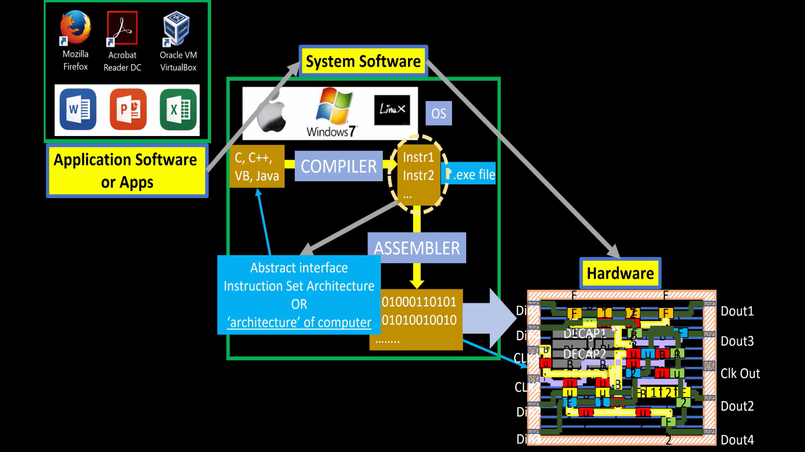

# OpenLane SKY130 Workshop – Day 1
## Inception of Open-Source EDA, OpenLANE and SKY130 PDK

### Author
**Varun Venkata**

### Workshop
VSD OpenLANE SKY130 Workshop

### Day Objectives

- Understand the ASIC Design Flow
- Learn OpenLANE Architecture
- Understand SKY130 PDK
- Study RISC-V and Open-Source Hardware
- Run Synthesis using OpenLANE
- Analyze Synthesis Results
---
## Table of Contents

1. Introduction
2. Software to Hardware Flow
3. Chip Components and SoC Architecture
4. RISC-V ISA
5. Open-Source ASIC Design
6. RTL to GDSII Flow
7. OpenLANE Flow
8. SKY130 PDK
9. Practical Lab
10. Synthesis Results
11. Key Learnings

---
# 1️⃣ Understanding Computer Abstraction Layers

## Why Do We Need Abstraction?

Humans communicate using programming languages, while computers understand only binary values (0 and 1). To bridge this gap, multiple abstraction layers are used, where each layer translates information into a form understandable by the next layer.

## Abstraction Flow

```text
High-Level Language (C, Python, Java)
            ↓
Compiler
            ↓
Assembly Language
            ↓
Assembler
            ↓
Machine Code
            ↓
Processor Hardware
            ↓
Transistor Switching
```

## Role of Each Layer
* **High-Level Language:** Allows programmers to write applications without worrying about hardware details.
* **Compiler:** Converts source code into assembly instructions.
* **Assembly Language:** Human-readable representation of machine instructions.
* **Machine Code:** Binary instructions executed directly by the processor.
* **ISA (Instruction Set Architecture):** Acts as a bridge between software and hardware by defining instructions, registers, and memory operations.

## Key Learning
The ISA is the fundamental interface between software and hardware. As VLSI engineers, our responsibility is to design hardware that correctly implements the ISA specifications.
<p align="center">
  
</p>

<p align="center"><b>Figure 1:</b> Software to Hardware Flow</p>
