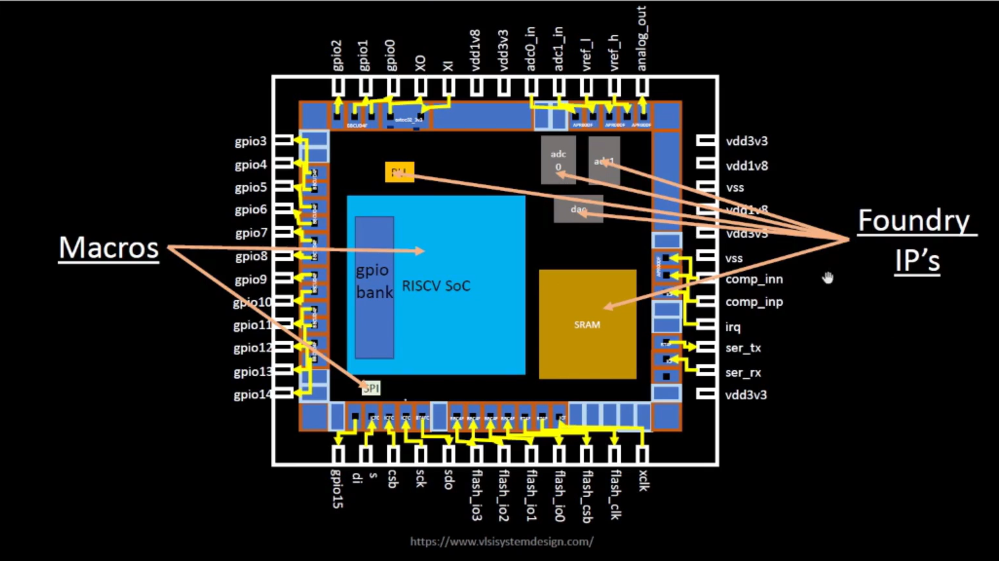

# OpenLane SKY130 Workshop – Day 1
## Inception of Open-Source EDA, OpenLANE and SKY130 PDK

### Author
**Varun Venkata**

### Workshop
VSD OpenLANE SKY130 Workshop

### Day Objectives

- Understand the ASIC Design Flow
- Learn OpenLANE Architecture
- Understand SKY130 PDK
- Study RISC-V and Open-Source Hardware
- Run Synthesis using OpenLANE
- Analyze Synthesis Results
---
## Table of Contents

1. Introduction
2. Software to Hardware Flow
3. Chip Components and SoC Architecture
4. RISC-V ISA
5. Open-Source ASIC Design
6. RTL to GDSII Flow
7. OpenLANE Flow
8. SKY130 PDK
9. Practical Lab
10. Synthesis Results
11. Key Learnings

---
# 1️⃣ Understanding Computer Abstraction Layers

## Why Do We Need Abstraction?

Humans communicate using programming languages, while computers understand only binary values (0 and 1). To bridge this gap, multiple abstraction layers are used, where each layer translates information into a form understandable by the next layer.

## Abstraction Flow

```text
High-Level Language (C, Python, Java)
            ↓
Compiler
            ↓
Assembly Language
            ↓
Assembler
            ↓
Machine Code
            ↓
Processor Hardware
            ↓
Transistor Switching
```

## Role of Each Layer
* **High-Level Language:** Allows programmers to write applications without worrying about hardware details.
* **Compiler:** Converts source code into assembly instructions.
* **Assembly Language:** Human-readable representation of machine instructions.
* **Machine Code:** Binary instructions executed directly by the processor.
* **ISA (Instruction Set Architecture):** Acts as a bridge between software and hardware by defining instructions, registers, and memory operations.

<p align="center">
  
</p>

<p align="center"><b>Figure 1:</b> Software to Hardware Flow</p>

# 2️⃣ Chip Components, Macros and Foundry IPs

## Overview

The figure below shows the internal organization of a System-on-Chip (SoC) along with its major building blocks. A modern chip consists of reusable digital and analog blocks integrated inside a single silicon die.

<p align="center">
  
</p>

<p align="center"><b>Figure 2:</b> SoC Architecture Showing Macros and Foundry IPs</p>

## Major Components

### Macros

Macros are large functional blocks that perform specific operations inside the chip. These blocks are generally reused across multiple designs.

Examples shown in the figure:

- RISC-V SoC Core
- GPIO Bank
- SRAM Memory
- SPI Interface

### Foundry IPs

Foundry IPs are pre-designed and pre-verified blocks supplied by the semiconductor foundry. These blocks are technology-dependent and optimized for the manufacturing process.

Examples shown in the figure:

- ADC (Analog-to-Digital Converter)
- PLL (Phase-Locked Loop)
- Analog Interfaces
- Power Management Blocks

## Importance of Macros and IPs

- Reduce design time and development cost.
- Improve reliability through proven designs.
- Simplify complex SoC integration.
- Enable faster time-to-market.

