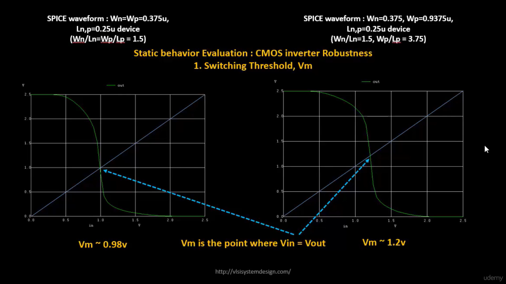
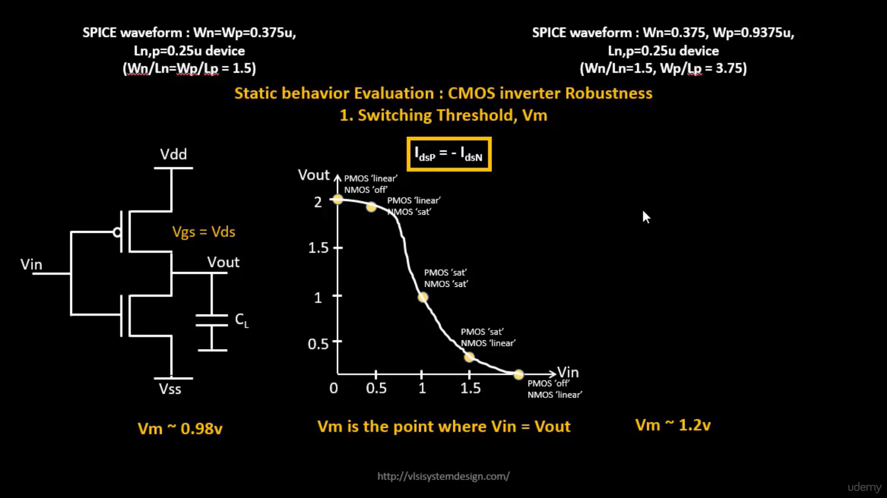
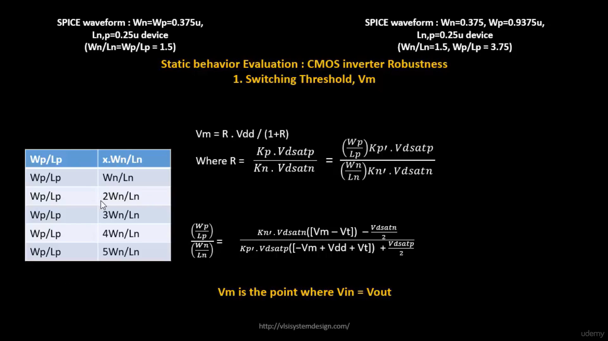
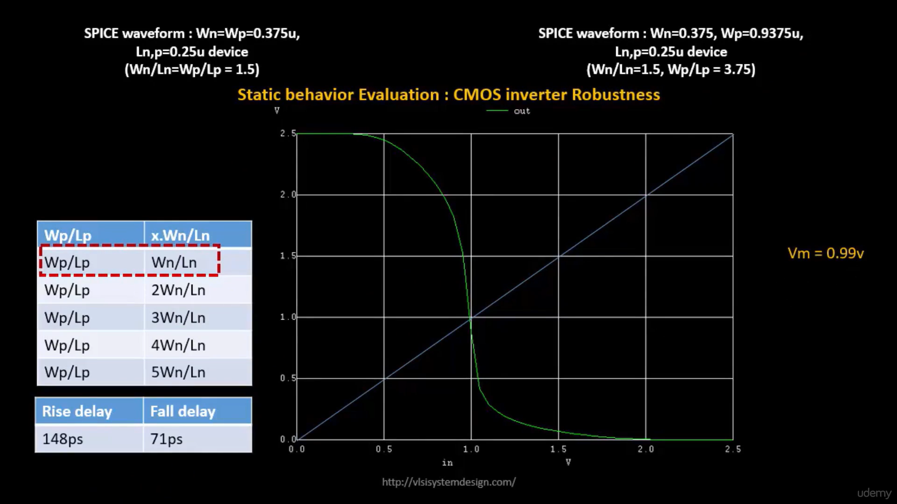
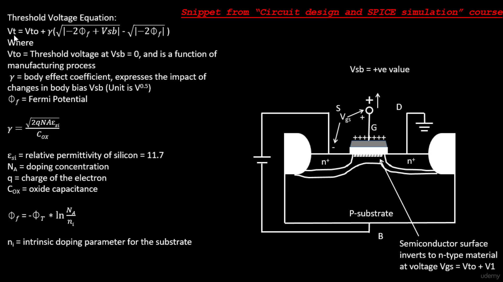
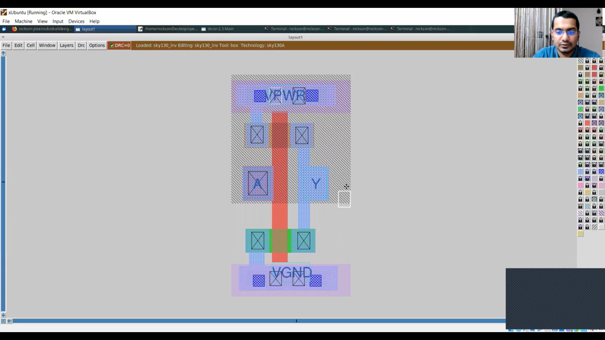
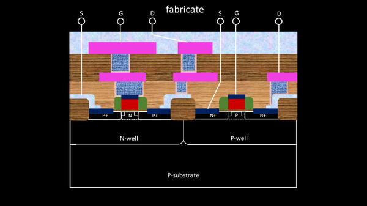

# Day 3 – Design Library Cell using Magic Layout and ngspice Characterization

## Overview
Focused on understanding CMOS inverter characteristics and designing a standard cell layout using the Magic VLSI layout editor. The session covered inverter robustness, switching threshold analysis, body effect, propagation delays, transistor sizing impact, and physical layout implementation in SKY130 technology. The behavior of the CMOS inverter was studied using SPICE simulations and theoretical equations, followed by layout realization in Magic.

---

# CMOS Inverter Robustness

A CMOS inverter is the fundamental building block of digital circuits. Its performance depends on several factors including transistor sizing, threshold voltage, propagation delay, noise margin, and switching threshold.

The robustness of an inverter is evaluated using its Voltage Transfer Characteristic (VTC), which shows how the output voltage changes with respect to the input voltage.

---

# Switching Threshold Voltage (Vm)

The switching threshold voltage (**Vm**) is defined as the point where:

$$
V_{in}=V_{out}=V_m
$$

At this point, both NMOS and PMOS transistors conduct simultaneously.

The drain currents satisfy:

$$
I_{DSP} = -I_{DSN}
$$

Vm plays an important role in determining:

* Noise Margins
* Switching Speed
* Static Power Consumption
* Inverter Robustness

---

## Switching Threshold Comparison
<p align="center">
  
</p>

<p align="center">
  <b>Figure 1:</b> switching_threshold_comparison
</p>

### Observation

Two CMOS inverter configurations were analyzed:

| NMOS Width | PMOS Width | Switching Threshold |
| ---------- | ---------- | ------------------- |
| 0.375 μm   | 0.375 μm   | ~0.98 V             |
| 0.375 μm   | 0.9375 μm  | ~1.2 V              |

### Analysis

When the PMOS width is increased, the pull-up strength becomes stronger. As a result, the switching threshold shifts toward a higher voltage value.

This demonstrates that transistor sizing directly influences inverter characteristics and can be adjusted to optimize circuit performance.

---

# Static Behavior Evaluation of CMOS Inverter

The static behavior of the inverter can be understood through the Voltage Transfer Characteristic (VTC).
<p align="center">
  
</p>

<p align="center">
  <b>Figure 2:</b> switching_threshold_regions
</p>

## Different Operating Regions

### Region 1

* PMOS : Linear Region
* NMOS : OFF

Output remains at logic HIGH.

### Region 2

* PMOS : Linear Region
* NMOS : Saturation Region

Output starts decreasing.

### Region 3

* PMOS : Saturation Region
* NMOS : Saturation Region

This region contains the switching threshold (**Vm**).

### Region 4

* PMOS : Saturation Region
* NMOS : Linear Region

Output falls rapidly.

### Region 5

* PMOS : OFF
* NMOS : Linear Region

Output reaches logic LOW.

---

# Mathematical Analysis of Switching Threshold

The switching threshold can be derived using the current balance equations of NMOS and PMOS devices.

<p align="center">
  
</p>

<p align="center">
  <b>Figure 3:</b> vm_equations
</p>
Mathematical Analysis of Switching Threshold

The switching threshold can be derived using the current balance equations of NMOS and PMOS devices.

The switching threshold is represented as:

V
m
	​

=
1+R
R⋅V
DD
	​

	​


Where:

R=
K
n
	​

V
dsatn
	​

K
p
	​

V
dsatp
	​

	​


The ratio R depends on:

NMOS width-to-length ratio
PMOS width-to-length ratio
Mobility ratio
Saturation voltages
Process parameters

---

# Propagation Delay Analysis

Propagation delay determines how quickly the inverter can respond to changes in the input signal.


<p align="center">
  
</p>

<p align="center">
  <b>Figure 4:</b> delay_analysis
</p>

## Results

| Parameter           | Value  |
| ------------------- | ------ |
| Rise Delay          | 148 ps |
| Fall Delay          | 71 ps  |
| Switching Threshold | 0.99 V |

### Analysis

The rise delay is greater than the fall delay because:

* Electron mobility in NMOS devices is higher.
* Hole mobility in PMOS devices is lower.
* NMOS pulls down the output faster than PMOS pulls it up.

Therefore, PMOS devices are usually made wider than NMOS devices to compensate for mobility differences and achieve balanced delays.

---

# Body Effect and Threshold Voltage Variation

Body effect is an important second-order effect in MOSFETs.

It occurs when a voltage difference exists between the source and body terminals.

As the source-to-body voltage increases, the threshold voltage also increases.

<p align="center">
  
</p>

<p align="center">
  <b>Figure 5:</b> body_effect
</p>

## Threshold Voltage Equation

The threshold voltage considering the body effect is expressed as:

```text
Vt = Vt0 + γ [ √(|−2ϕf + VSB|) − √(|−2ϕf|) ]
```

### Parameters

| Symbol | Description                        |
| ------ | ---------------------------------- |
| Vt     | Threshold voltage with body effect |
| Vt0    | Threshold voltage when VSB = 0     |
| γ      | Body effect coefficient            |
| ϕf     | Fermi potential                    |
| VSB    | Source-to-body voltage             |

### Observation

An increase in body bias results in:

* Increased threshold voltage
* Reduced drive current
* Increased propagation delay
* Reduced switching speed

This effect must be considered during transistor characterization and standard cell design.

---

# CMOS Inverter Layout Design using Magic

After understanding inverter behavior theoretically, a CMOS inverter layout was implemented using the Magic VLSI layout editor with SKY130 technology.


<p align="center">
  
</p>

<p align="center">
  <b>Figure 6:</b> inverter_layout_magic
</p>

## Layout Components

### PMOS Transistor

* Located in the N-Well region.
* Connected to VDD rail.

### NMOS Transistor

* Located in the P-Substrate.
* Connected to GND rail.

### Input Terminal (A)

* Connected through a common polysilicon gate.
* Controls both PMOS and NMOS simultaneously.

### Output Terminal (Y)

* Formed by connecting the drains of PMOS and NMOS.
* Produces the inverted output.

### Power Rails

* VPWR connected to VDD.
* VGND connected to Ground.

---

## Advantages of CMOS Inverter Layout

* Very low static power consumption.
* High noise immunity.
* Full rail-to-rail output swing.
* High switching speed.
* Suitable as a standard cell for digital design.

---

# Key Learnings

During Day 3, the following concepts were learned:

* CMOS inverter robustness evaluation.
* Voltage Transfer Characteristics (VTC).
* Switching Threshold Voltage (Vm).
* Effect of transistor sizing on inverter performance.
* PMOS and NMOS operating regions.
* Propagation delay analysis.
* Body effect and threshold voltage variation.
* Standard cell layout design using Magic.
* SKY130 technology-based inverter implementation.
* Relationship between theoretical analysis and physical layout design.

---


# Detailed CMOS Fabrication Process Using 16-Mask Methodology

## Introduction

Before designing a CMOS inverter layout in Magic, it is important to understand how the actual transistor is fabricated inside a silicon wafer. Every MOSFET present in a standard cell library originates from a sequence of carefully controlled fabrication steps involving oxidation, ion implantation, diffusion, etching, deposition, and photolithography.

The SKY130 process utilizes a 16-mask fabrication flow to construct PMOS and NMOS devices, interconnect them using metal layers, and finally package them into a functional integrated circuit.

The complete fabrication sequence transforms a plain silicon wafer into millions of interconnected transistors capable of performing digital computation.

---

## Step 1: Starting with a Silicon Substrate

The fabrication process begins with a lightly doped P-type silicon wafer.

This wafer acts as the foundation upon which all transistors are constructed. Silicon is chosen because of its excellent semiconductor properties and compatibility with large-scale manufacturing.

At this stage, the wafer is simply a polished semiconductor surface with no transistors or interconnections.

### Objective

* Provide a base material for device fabrication.
* Ensure uniform electrical characteristics across the chip.

---

## Step 2: Formation of the N-Well Region

Since a CMOS inverter requires both PMOS and NMOS transistors, regions with opposite doping concentrations must be created.

Using the first photolithography mask, selected portions of the P-substrate are exposed and implanted with donor impurities such as phosphorus or arsenic.

After implantation, a high-temperature drive-in process diffuses the dopants deeper into the silicon.

The resulting N-Well region will later host the PMOS transistor.

### Why This Step Is Important

Without the N-Well, both transistors would be formed in the same substrate, making complementary CMOS operation impossible.

---

## Step 3: Isolation of Neighboring Devices

Modern integrated circuits contain millions of transistors placed extremely close together.

If adjacent devices are not isolated, leakage currents can flow through the substrate and cause malfunction.

To prevent this, active regions are defined and thick field oxide regions are grown around them.

These oxide regions electrically isolate neighboring devices and ensure that current flows only through intended transistor channels.

### Importance

Device isolation improves reliability, reduces leakage current, and minimizes unwanted electrical interactions.

---

## Step 4: Gate Oxide Growth

A very thin layer of silicon dioxide is thermally grown over the active regions.

This oxide layer becomes the gate dielectric of the MOS transistor.

Although only a few nanometers thick, this layer plays a crucial role because it separates the conducting gate terminal from the semiconductor channel.

When a voltage is applied to the gate, an electric field passes through this oxide and controls channel formation underneath.

### Importance

The gate oxide determines:

* Threshold voltage
* Gate capacitance
* Switching speed
* Power consumption

A high-quality oxide is essential for reliable transistor operation.

---

## Step 5: Polysilicon Gate Formation

A layer of polysilicon is deposited over the wafer and patterned using photolithography.

The remaining polysilicon structures form the gates of the NMOS and PMOS transistors.

These gates serve as the control terminals of the devices.

An important advantage of forming the gate before source/drain implantation is that the gate itself acts as a self-alignment reference.

### Importance

This self-aligned gate process greatly improves transistor accuracy and reduces parasitic capacitances.

---

## Step 6: Threshold Voltage Engineering

Different applications require transistors with carefully controlled switching characteristics.

To achieve the desired threshold voltage, ion implantation is performed near the channel region.

Separate masks are used for PMOS and NMOS threshold adjustment.

This step fine-tunes the voltage required to create an inversion layer under the gate.

### Importance

Threshold voltage directly affects:

* Switching speed
* Leakage current
* Dynamic power consumption
* Noise margins

---

## Step 7: Lightly Doped Drain (LDD) Formation

As transistor dimensions shrink, very strong electric fields appear near the drain region.

These electric fields can accelerate carriers and damage the transistor over time.

To reduce this effect, lightly doped drain regions are introduced before heavy source/drain implantation.

A low-concentration dopant implant is performed near the gate edges.

### Importance

LDD structures:

* Reduce hot-carrier degradation
* Improve transistor lifetime
* Enhance long-term reliability

---

## Step 8: Sidewall Spacer Formation

A thin dielectric layer is deposited over the wafer and anisotropically etched.

This leaves dielectric spacers attached to the sides of the polysilicon gate.

These spacers serve as protective barriers during subsequent implantation steps.

### Importance

Sidewall spacers define the separation between LDD regions and heavily doped source/drain regions.

They are critical for modern short-channel devices.

---

## Step 9: Source and Drain Formation

Heavy ion implantation is now performed.

For NMOS devices:

* N+ source and drain regions are created.

For PMOS devices:

* P+ source and drain regions are created.

After implantation, annealing repairs crystal damage and activates the dopants.

### Importance

Source and drain regions provide low-resistance current paths required for transistor operation.

At this stage, functional NMOS and PMOS devices have been physically created.

---

## Step 10: Contact Formation

Although transistors now exist, they are still buried under insulating layers.

Small openings called contacts are etched through the oxide to expose source, drain, and gate terminals.

These openings act as access points for metal interconnections.

### Importance

Contacts create the electrical bridge between the transistor and the metal routing network.

---

## Step 11: Metal Layer Formation

A metal layer is deposited across the wafer and patterned.

This forms the first routing layer responsible for connecting transistors together.

For a CMOS inverter:

* PMOS source connects to VDD.
* NMOS source connects to GND.
* Gates are shorted together to form the input.
* Drains are connected together to form the output.

### Importance

Without metal routing, individual transistors cannot communicate to form logic circuits.

---

## Step 12: Via Formation and Multi-Level Routing

As circuits become more complex, one metal layer is insufficient.

Vias are created to connect different metal layers vertically.

Additional metal layers are deposited and patterned to support:

* Signal routing
* Clock distribution
* Power delivery

### Importance

Multi-level routing enables large-scale integration containing millions of transistors.

---

## Step 13: Passivation Layer Deposition

A final protective dielectric layer is deposited over the completed chip.

Only bonding pad regions are left exposed.

This layer protects the circuit from:

* Moisture
* Dust
* Chemical contamination
* Mechanical damage

### Importance

Passivation ensures long-term reliability of the fabricated integrated circuit.

---

## Final CMOS Inverter Structure

After completion of all fabrication steps:

* PMOS transistor resides inside the N-Well.
* NMOS transistor resides in the P-Substrate.
* Gates are connected together to form the input terminal (A).
* Drains are connected together to form the output terminal (Y).
* PMOS source is connected to VPWR.
* NMOS source is connected to VGND.

<p align="center">
  
</p>

<p align="center">
  <b>Figure 7:</b> 16_Mask_CMOS_Fabricate
</p>

This structure forms a CMOS inverter capable of providing rail-to-rail output swing, low static power consumption, high noise immunity, and robust switching performance.

---

## Fabrication-to-Layout Correlation

The Magic layout designed during Day 3 is a geometric representation of the same fabrication process.

Each layer visible in the layout corresponds to an actual fabrication step:

| Layout Layer    | Fabrication Step           |
| --------------- | -------------------------- |
| N-Well          | N-Well Implantation        |
| Poly            | Gate Formation             |
| Diffusion       | Source/Drain Formation     |
| Contact         | Contact Etching            |
| Metal 1         | Routing Layer              |
| VPWR/VGND Rails | Power Distribution Network |

Understanding this relationship is crucial because every polygon drawn in Magic eventually translates into one or more masks used during silicon manufacturing.


# What I Learned

By the end of Day 3, I was able to understand the complete journey of a CMOS inverter—from silicon fabrication using the 16-mask process, to transistor characterization using theoretical and simulation-based analysis, and finally to its physical realization as a standard cell layout in Magic. This knowledge provides a strong foundation for the upcoming stages of ASIC physical design and standard cell characterization.

