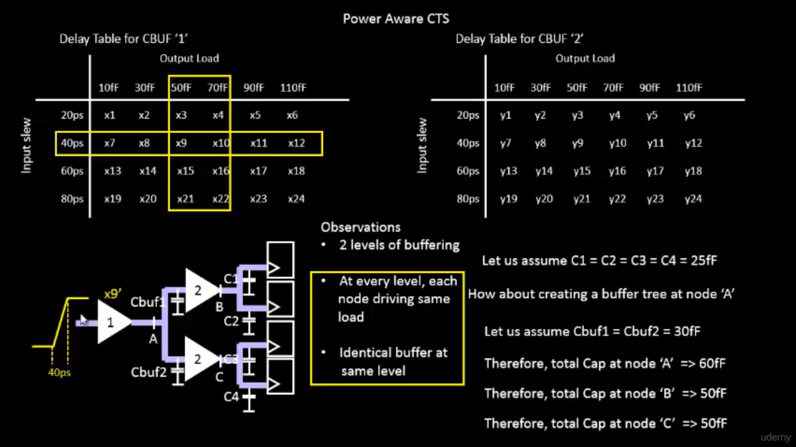
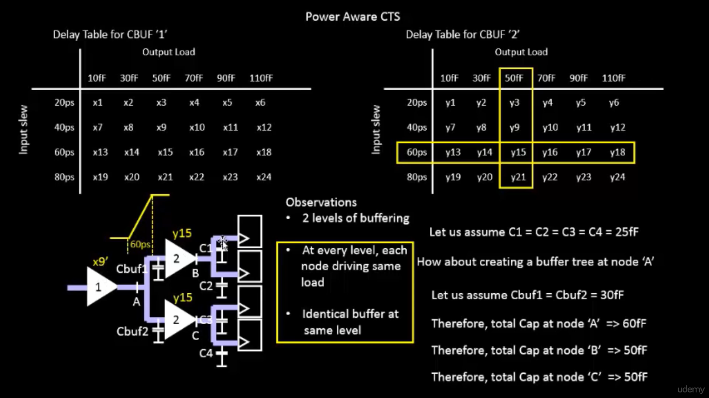
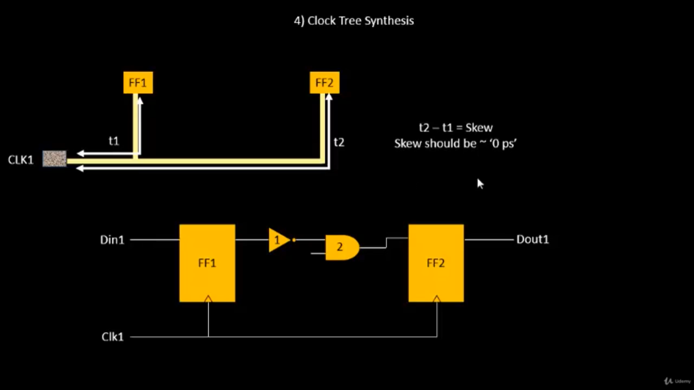

# Day 4: Pre-layout Timing Analysis and Importance of Good Clock Tree

## Overview

In the VLSI physical design flow, timing analysis plays a critical role in determining whether a design can operate reliably at the target clock frequency. Before Clock Tree Synthesis (CTS) is performed, designers carry out **pre-layout timing analysis** using ideal clock assumptions to estimate timing behavior and identify potential violations.

The clock network is often referred to as the *heartbeat of a digital system* because every sequential element such as flip-flops and registers depends on the clock signal for synchronization. A poorly designed clock tree can introduce excessive skew, uncertainty, timing violations, and increased power consumption. Therefore, understanding clock distribution and timing behavior before CTS is essential for achieving timing closure.

This session focused on Power-Aware Clock Tree Synthesis, delay modeling, clock buffering, clock shielding, crosstalk effects, setup and hold analysis, clock skew, and timing uncertainty.

---

# Power-Aware Clock Tree Synthesis

The clock network contributes significantly to the total dynamic power consumption of a chip because it switches continuously, regardless of whether data activity exists.

To reduce unnecessary switching activity, **clock gating** techniques are used. Clock gating enables the clock signal only when a particular logic block is active.

Clock Gating Using AND Logic

The clock is propagated only when the enable signal is active.

Logic Equation
Y = EN × CLK
Truth Table
EN	CLK	Y
0	0	0
0	1	0
1	0	0
1	1	1
Observation

When EN = 0, clock transitions are blocked, preventing unnecessary power consumption.

Clock Gating Using OR Logic
Logic Equation
Y = EN + CLK
Truth Table
EN	CLK	Y
0	0	0
0	1	1
1	0	1
1	1	1
### Advantages of Power-Aware CTS

* Reduces dynamic power consumption
* Minimizes switching activity
* Improves power efficiency
* Reduces heat dissipation
* Extends battery life in portable devices

---

## Screenshot

```markdown

```

---

# Delay Tables and Timing Models

During Clock Tree Synthesis, the EDA tool must estimate the delay introduced by every cell.

Standard cell libraries contain pre-characterized **delay tables** that provide delay information based on operating conditions.

Two major parameters affect cell delay:

### Input Slew

Input slew defines the rate at which the signal transitions between logic levels.

A slower input transition generally increases propagation delay.

### Output Load

Output load represents the total capacitance connected to the output pin.

Larger loads require more charging and discharging time, increasing delay.

The CTS engine uses these delay tables for:

* Buffer selection
* Delay estimation
* Timing optimization
* Static Timing Analysis

---

## Screenshot

```markdown

```

---

# Clock Tree Synthesis (CTS)

Clock Tree Synthesis is the process of distributing the clock signal from the source to all sequential elements while maintaining balanced arrival times.

## Objectives of CTS

* Minimize clock skew
* Minimize insertion delay
* Balance clock arrival times
* Improve timing closure
* Reduce clock power consumption

A good clock tree ensures that all sequential elements receive the clock signal at nearly the same instant.

---

# Load Balancing in Clock Trees

Balanced loading is essential to reduce clock skew.

Consider the following load values:

```text
C1 = C2 = C3 = C4 = 25fF
Cbuf1 = Cbuf2 = 30fF
```

### Load at Node A

```text
LoadA = Cbuf1 + Cbuf2
       = 30fF + 30fF
       = 60fF
```

### Load at Node B

```text
LoadB = C1 + C2
       = 25fF + 25fF
       = 50fF
```

### Load at Node C

```text
LoadC = C3 + C4
       = 25fF + 25fF
       = 50fF
```

Since Node B and Node C drive identical loads, their delays become nearly equal, helping achieve low clock skew.

---

## Screenshot

```markdown

```

---

# H-Tree Clock Distribution

An H-Tree is a symmetric clock distribution structure used to deliver clock signals with equal path lengths.

### Advantages

* Equal propagation delay
* Symmetric routing
* Low clock skew
* Better timing performance

The ideal condition for an H-Tree is:

```text
Clock Skew ≈ 0 ps
```

H-Tree structures are widely used in high-performance processors because of their balanced architecture.

---

# Clock Buffering

Long interconnect wires introduce parasitic resistance and capacitance.

The delay associated with an interconnect can be modeled using the RC time constant:

```text
τ = RC
```

Where:

* `R` = Resistance
* `C` = Capacitance
* `τ` = Time Constant

Excessive RC delay causes:

* Slow transitions
* Increased propagation delay
* Reduced signal integrity

To overcome these issues, buffers are inserted into the clock path.

### Benefits of Buffering

* Restores signal strength
* Improves slew rate
* Reduces delay
* Drives larger fanout loads
* Improves clock quality

---

## Screenshot

```markdown

```

---

# Clock Net Shielding

Clock signals are highly sensitive to noise and interference.

When signal wires are routed close to clock wires, capacitive coupling may introduce unwanted disturbances.

To protect clock nets, shielding techniques are employed.

Shield wires are connected to:

```text
VDD
or
GND
```

and routed alongside the clock net.

### Benefits

* Reduces crosstalk
* Improves signal integrity
* Minimizes delay variation
* Enhances timing predictability

---

## Screenshot

```markdown

```

---

# Glitches and Their Effects

A glitch is a temporary unwanted pulse that appears on a signal line.

### Causes of Glitches

* Crosstalk
* Capacitive coupling
* Switching noise
* Routing issues

### Effects of Glitches

* Incorrect data capture
* Memory corruption
* False triggering of flip-flops
* Functional failure

Maintaining clock integrity is essential to prevent glitch-related failures.

---

# Crosstalk and Delta Delay

When adjacent wires switch simultaneously, capacitive coupling can occur between them.

This phenomenon is known as **Crosstalk**.

### Before Crosstalk

```text
Delay = D
```

### After Crosstalk

```text
Delay = D + Δ
```

Where:

```text
Δ = Crosstalk Delta Delay
```

This additional delay can affect clock arrival times and increase clock skew.

---

## Screenshot

```markdown

```

---

# Clock Skew

Clock skew is the difference in clock arrival times between two sequential elements.

The skew equation is:

```text
Clock Skew = |Δ1 - Δ2|
```

Where:

* `Δ1` = Launch Clock Delay
* `Δ2` = Capture Clock Delay

### Ideal Condition

```text
Clock Skew ≈ 0 ps
```

Large clock skew can result in:

* Setup violations
* Hold violations
* Reduced performance

Therefore, minimizing skew is one of the primary objectives of CTS.

---

# Static Timing Analysis (STA)

Static Timing Analysis verifies timing without applying actual input vectors.

Instead of simulation, STA evaluates all possible timing paths mathematically.

STA is used to analyze:

* Setup timing
* Hold timing
* Clock skew
* Clock uncertainty
* Slack values

STA is one of the most important signoff checks in the VLSI design flow.

---

# Setup Timing Analysis

Setup analysis ensures that data arrives at the destination flip-flop before the next active clock edge.

Assume:

```text
Clock Frequency = 1 GHz
Clock Period = 1 ns
```

### Setup Time

Setup time is the minimum duration before the active clock edge during which data must remain stable.

### Setup Condition

```text
θ < (T - S)
```

Where:

* `θ` = Data Path Delay
* `T` = Clock Period
* `S` = Setup Time

If this condition is violated, the flip-flop may capture incorrect data.

---

## Screenshot

```markdown

```

---

# Clock Jitter and Timing Uncertainty

In practical circuits, clock edges are not perfectly periodic.

The variation in clock edge position is known as **Clock Jitter**.

To account for this variation, timing analysis includes Setup Uncertainty:

```text
SU = Setup Uncertainty
```

Sources of uncertainty include:

* Clock jitter
* Process variation
* Voltage variation
* Temperature variation

---

# Setup Analysis with Real Clocks

In real designs, clock networks include:

* Wire delay
* Buffer delay
* RC delay
* Clock uncertainty

The setup timing equation becomes:

```text
(θ + Δ1) < (T + Δ2) - S - SU
```

Where:

* `Δ1` = Launch Clock Delay
* `Δ2` = Capture Clock Delay
* `SU` = Setup Uncertainty

### Setup Slack

```text
Slack = Data Required Time - Data Arrival Time
```

Condition for timing closure:

```text
Slack ≥ 0
```

---

# Hold Timing Analysis

Hold analysis ensures that data remains stable immediately after the active clock edge.

### Hold Condition

```text
(θ + Δ1) > H + Δ2 + HU
```

Where:

* `H` = Hold Time
* `HU` = Hold Uncertainty

### Hold Slack

```text
Slack = Data Arrival Time - Data Required Time
```

Condition:

```text
Slack ≥ 0
```

If slack becomes negative, a hold violation occurs.

---

## Screenshot

```markdown

```

---

# Key Learnings

* Pre-layout timing analysis uses ideal clocks before CTS implementation.
* Clock Tree Synthesis distributes clock signals with balanced delays.
* Power-aware CTS reduces unnecessary clock switching activity.
* Delay tables are fundamental to timing analysis.
* Buffering compensates for RC delay in long interconnects.
* Shielding protects clock nets from noise and crosstalk.
* Crosstalk introduces delta delay and increases skew.
* Setup and hold analyses ensure reliable operation.
* Positive slack indicates successful timing closure.

---

# Conclusion

Day 4 provided a comprehensive understanding of pre-layout timing analysis and the importance of a well-designed clock tree. The concepts of Power-Aware CTS, load balancing, H-Tree distribution, buffering, shielding, crosstalk mitigation, clock skew, setup analysis, hold analysis, jitter, uncertainty, and slack calculation were explored in detail. These concepts form the foundation of timing closure and reliable clock distribution in modern VLSI physical design.
