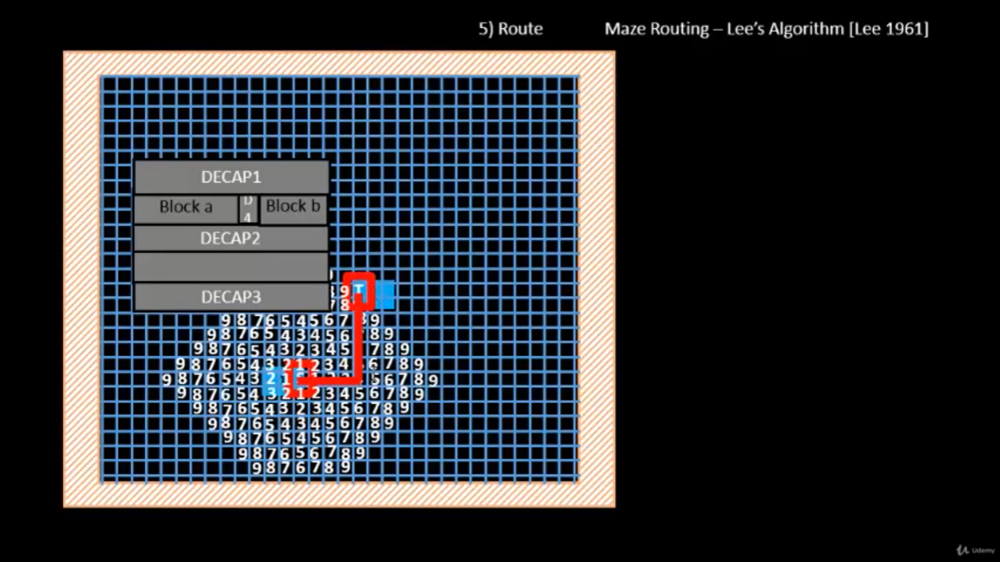
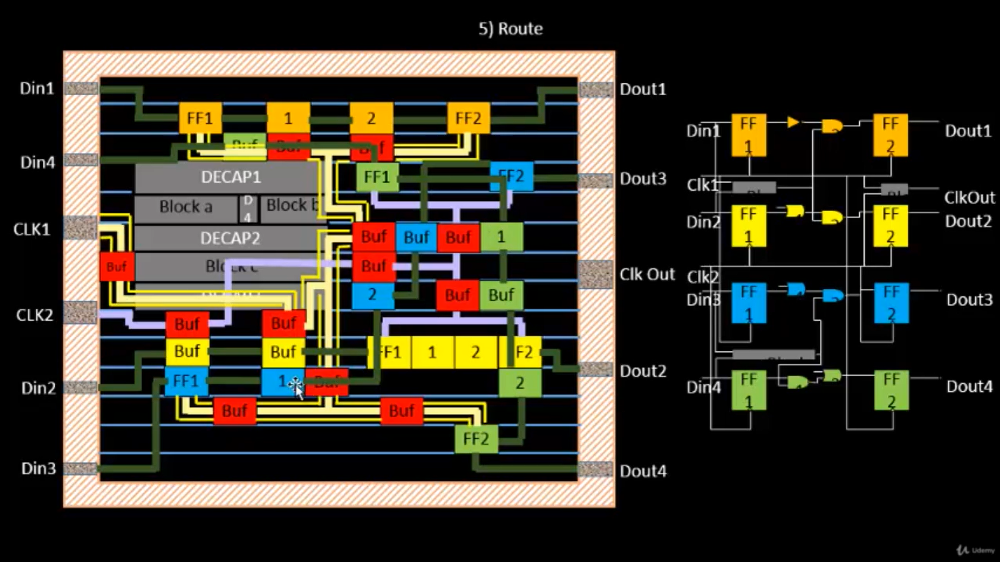
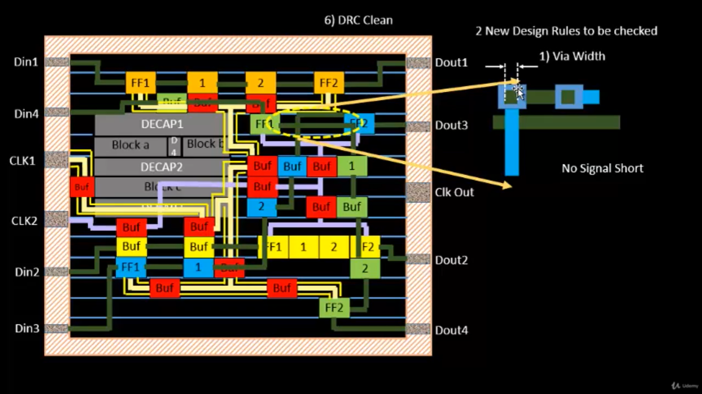
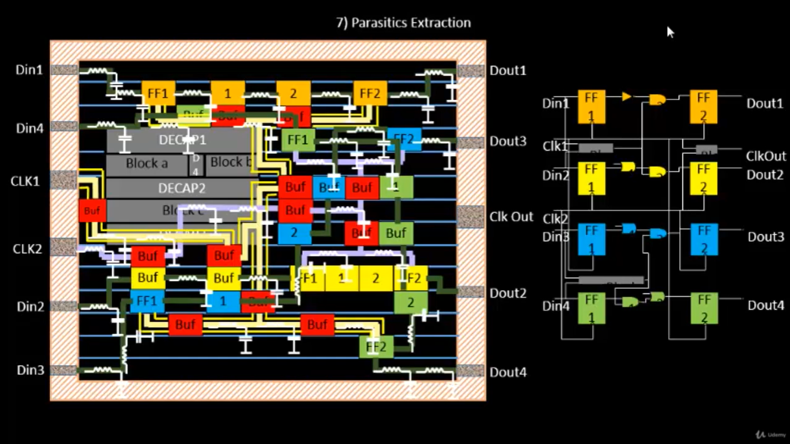

# Day 5: Routing, Design Rule Checking and Parasitic Extraction

# Overview

After placement and Clock Tree Synthesis (CTS), the design enters one of the most critical stages of the physical design flow: **Routing**. The objective of routing is to establish reliable electrical connections between standard cells, macros, I/O pins, and clock network elements while satisfying all manufacturing and design constraints.

Routing plays a crucial role in determining timing performance, signal integrity, power consumption, and manufacturability. Even if floorplanning and placement are optimal, poor routing can introduce congestion, excessive delay, crosstalk, and design rule violations that prevent successful chip fabrication.

In this section, I explored routing methodologies, detailed routing using TritonRoute, design rule verification, and parasitic extraction techniques used in modern ASIC implementation flows.

---

# Understanding Routing in Physical Design

Routing is the process of creating physical metal interconnections that implement the logical connectivity described by the synthesized netlist.

A routing engine must determine:

* Which metal layers to use
* The optimal path between source and destination
* Via insertion locations
* Congestion avoidance strategies
* Compliance with manufacturing rules

The goal is not simply connectivity, but achieving connectivity while minimizing wirelength, delay, congestion, and fabrication risk.

---

# Maze Routing using Lee's Algorithm

Lee's Algorithm is one of the earliest and most widely recognized routing algorithms used in VLSI physical design.

The routing area is represented as a grid. Starting from the source node, the algorithm performs a wave expansion until the target node is reached. The shortest path is then obtained through backtracking.

## Routing Procedure

### Step 1: Generate Routing Grid

The routing region is divided into discrete grid cells.

### Step 2: Define Source and Target

Source and destination nodes are identified.

### Step 3: Wave Propagation

Neighboring grid cells are labeled with increasing cost values as the wave expands outward.

### Step 4: Backtracking

After reaching the destination, the shortest path is reconstructed.

### Step 5: Path Optimization

Among multiple valid paths, routes with fewer bends are preferred to reduce resistance and routing complexity.

<b>Figure 1:</b> Maze Routing using Lee's Algorithm

### Observation

The algorithm guarantees the shortest valid route while avoiding obstacles. Although computationally expensive for large designs, it forms the conceptual foundation for many modern routing strategies.

---

# Routing Stages

Modern routing is divided into two major phases.

## Global Routing

Global routing determines an approximate path for each net and allocates routing resources.

### Responsibilities

* Congestion estimation
* Resource allocation
* Metal layer assignment
* Routing guide generation

The output of global routing consists of routing guides rather than exact wire geometries.

---

## Detailed Routing

Detailed routing transforms routing guides into actual metal segments and vias.

### Responsibilities

* Exact track assignment
* Via insertion
* Pin accessibility verification
* Design rule compliance
* Connectivity completion

<b>Figure 2:</b> Routed Design after CTS

### Observation

The routed layout contains signal nets, clock networks, buffers, and flip-flops interconnected across multiple metal layers. Routing quality directly impacts timing closure and signal integrity.

---

# Detailed Routing using TritonRoute

TritonRoute is the detailed routing engine used in the OpenROAD flow.

Unlike traditional routing approaches that focus solely on connectivity, TritonRoute simultaneously considers:

* Routing correctness
* Design rule compliance
* Manufacturability
* Pin accessibility
* Connectivity completion

## TritonRoute Workflow

### Initial Detailed Routing

Generates an initial routing solution using global routing information.

### Route Guide Utilization

Uses preprocessed routing guides generated during global routing.

### Connectivity Verification

Ensures complete connectivity between all routing segments and pins.

### Search and Repair

Iteratively resolves routing violations until a clean solution is achieved.

### Key Features

* Initial detailed routing
* Inter-guide connectivity support
* Parallel routing capability
* Sequential layer routing strategy
* DRC-aware routing methodology

---

# Preprocessed Route Guides

Before detailed routing begins, routing guides generated during global routing undergo preprocessing.

## Preprocessing Operations

1. Splitting
2. Merging
3. Bridging

These operations simplify routing regions and improve detailed routing efficiency.

## Requirements of Preprocessed Guides

* Unit width representation
* Preferred routing direction
* Connectivity preservation
* Reduced routing ambiguity

### Observation

Preprocessed guides provide structured routing regions that allow the detailed router to operate more efficiently while preserving net connectivity.

---

# Inter-Guide Connectivity

Routing guides belonging to the same net must remain electrically connected throughout the routing process.

Inter-guide connectivity ensures:

* Continuous signal propagation
* Proper layer transitions
* Reliable net connectivity
* Correct routing completion

Without inter-guide connectivity, disconnected routing segments may be generated.

---

# Access Points and Connectivity Handling

To facilitate routing, TritonRoute introduces the concept of Access Points.

## Access Point (AP)

An Access Point is an on-grid location used to connect:

* Pins
* Lower metal layers
* Upper metal layers
* I/O ports

## Access Point Cluster (APC)

An Access Point Cluster represents a collection of access points originating from the same physical routing object.

### Observation

Access Points provide flexible routing entry and exit locations, improving connectivity and reducing routing complexity.

---

# Routing Topology Optimization

After connectivity is established, routing topology must be optimized.

The optimization process aims to minimize:

* Total wirelength
* Via count
* Congestion
* Signal delay

Many routing engines use graph-based techniques such as Minimum Spanning Trees (MSTs) to achieve efficient connectivity.

### Observation

Topology optimization improves routing efficiency while reducing routing resources and timing degradation.

---

# Design Rule Checking (DRC)

After routing completion, the layout must be validated against fabrication constraints.

A DRC-clean design is mandatory before tapeout.

## Important Wire Rules

### Wire Width

Defines the minimum allowable width of a metal segment.

### Wire Spacing

Defines the minimum separation between neighboring wires.

### Wire Pitch

Represents the center-to-center distance between adjacent routing tracks.

## Additional Via Rules

### Via Width

Controls via dimensions.

### Via Spacing

Defines minimum separation between neighboring vias.

## Common DRC Violations

* Signal Shorts
* Spacing Violations
* Via Violations

<b>Figure 3:</b> DRC Clean Routed Layout

### Observation

A DRC-clean layout guarantees compliance with manufacturing constraints and significantly improves fabrication reliability.

---

# Parasitic Extraction

Physical interconnects introduce unavoidable parasitic effects that influence circuit behavior.

## Sources of Parasitics

### Parasitic Resistance

Caused by finite metal conductivity.

### Parasitic Capacitance

Generated between wires and substrate.

### Coupling Capacitance

Occurs between adjacent signal nets.

## Importance of Extraction

Parasitic extraction enables:

* Accurate delay estimation
* Signal integrity analysis
* Power estimation
* Signoff timing verification

<b>Figure 4:</b> Extracted RC Network after Routing

### Observation

The extracted RC network provides a realistic representation of interconnect behavior and forms the basis of post-route timing analysis.

---

# Key Learnings

* Routing converts logical connectivity into physical metal interconnects.
* Lee's Algorithm demonstrates shortest-path routing concepts.
* Global routing generates routing guides for detailed routing.
* TritonRoute performs DRC-aware detailed routing.
* Access Points improve connectivity flexibility.
* DRC verification ensures manufacturability.
* Parasitic extraction models real interconnect behavior for accurate signoff analysis.

---

# Conclusion

Routing represents the stage where logical connectivity becomes physical reality. Through global routing, detailed routing, DRC verification, and parasitic extraction, the design transitions from a placed netlist into a manufacturable silicon implementation. TritonRoute plays a critical role in achieving routing correctness while maintaining design rule compliance and manufacturability. The extracted parasitic network further enables accurate timing analysis, ensuring that the final design is both functionally correct and fabrication ready.
